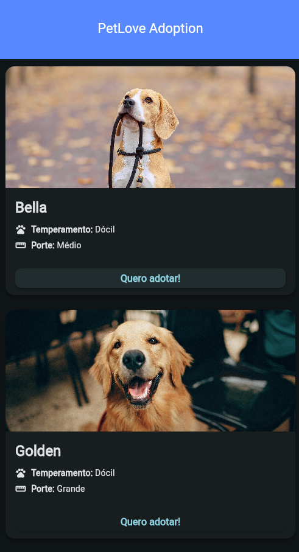
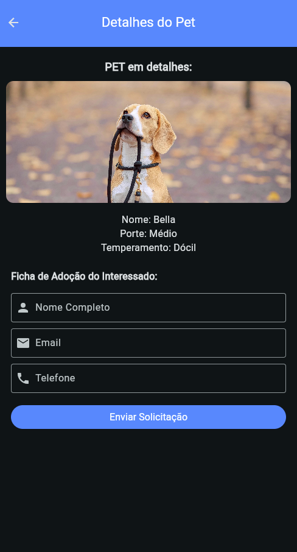

# 🐾 Pet Love Adoption (MVP)

 


Aplicativo **Flutter/Dart** para adoção de pets, desenvolvido como um **MVP (Minimum Viable Product)** para explorar conceitos de desenvolvimento mobile, navegação, gerenciamento de estado e construção de interfaces amigáveis.

---

## 📱 Sobre o projeto

O **Pet Love Adoption** tem como objetivo simular uma plataforma simples de adoção de animais, conectando pessoas interessadas em adotar com pets disponíveis.

Alguns objetivos do MVP:

- Apresentar uma **lista de pets** para adoção.
- Exibir **detalhes do pet** (nome, idade, raça, descrição, etc.).
- Prover uma experiência de navegação simples e agradável.
- Servir como base de estudo para **Flutter / Dart** (estruturas de pastas, widgets, navegação, etc.).

> ⚠️ Importante: este projeto é um MVP acadêmico/didático. Funcionalidades podem estar incompletas ou em constante evolução.

---

## ✨ Funcionalidades (atuais / planejadas)

- [x] Estrutura básica Flutter (Android, iOS e Web).
- [x] Tela inicial com tema “adoção de pets”.
- [x] Listagem de pets disponíveis para adoção.
- [x] Tela de detalhes do pet.
- [x] Botão de ação para “Quero adotar”.
- [ ] Filtro simples por tipo de animal (cães, gatos, etc.).


Você pode ajustar essas caixas de seleção conforme for implementando as features. 😉

---

## 🧱 Tecnologias utilizadas

- [Flutter](https://flutter.dev/)
- [Dart](https://dart.dev/)
- Widgets baseados em **Material Design**
- Suporte a:
    - Android
    - iOS
    - Web

---

## 🗂 Estrutura do projeto (resumo)

```text
pet-love-adoption-mvp/
├─ android/        # Configurações do app para Android
├─ ios/            # (se aplicável) Configurações para iOS
├─ web/            # Suporte à versão Web do Flutter
├─ lib/            # Código Dart (telas, widgets, modelos, etc.)
├─ images/         # Imagens e assets do projeto
├─ pubspec.yaml    # Dependências e configurações do Flutter
└─ README.md       # Documentação do projeto

```
🔧 Requisitos

Antes de rodar o projeto, garanta que você tem:

Flutter SDK
instalado e configurado

Dart incluído na instalação do Flutter

Emulador ou dispositivo físico configurado (Android/iOS) ou navegador para Web

flutter doctor sem erros críticos

▶️ Como executar o projeto

Clone o repositório
git clone https://github.com/andreyquadros/pet-love-adoption-mvp.git
cd pet-love-adoption-mvp

Instale as dependências
flutter pub get

Execute no emulador/dispositivo
flutter run

Ou especifique a plataforma:
# Web
flutter run -d chrome

# Android (emulador/dispositivo)
flutter run -d android

# iOS (emulador/dispositivo)
flutter run -d ios

🤝 Contribuição

Sinta-se à vontade para:

Abrir issues com bugs ou sugestões.

Criar pull requests com melhorias de código, layout ou documentação.

Utilizar o projeto como base para estudos em Flutter.


👨‍💻 Autor

Prof. Andrey Alencar Quadros
Desenvolvedor e professor, explorando Flutter/Dart e desenvolvimento mobile.


